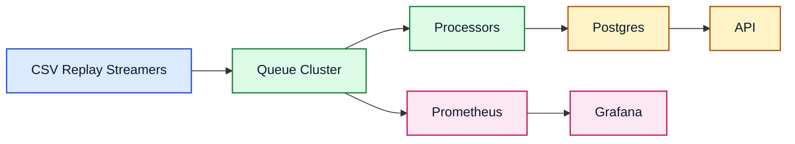
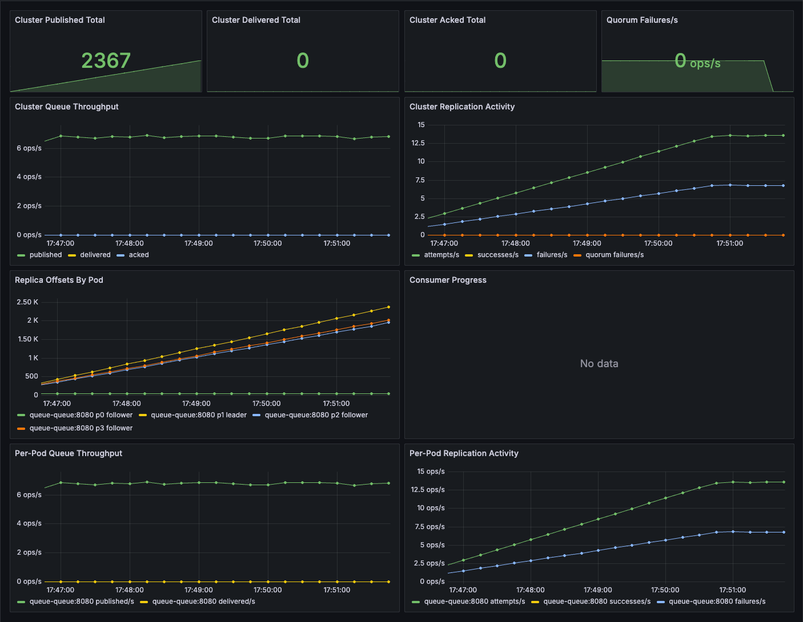
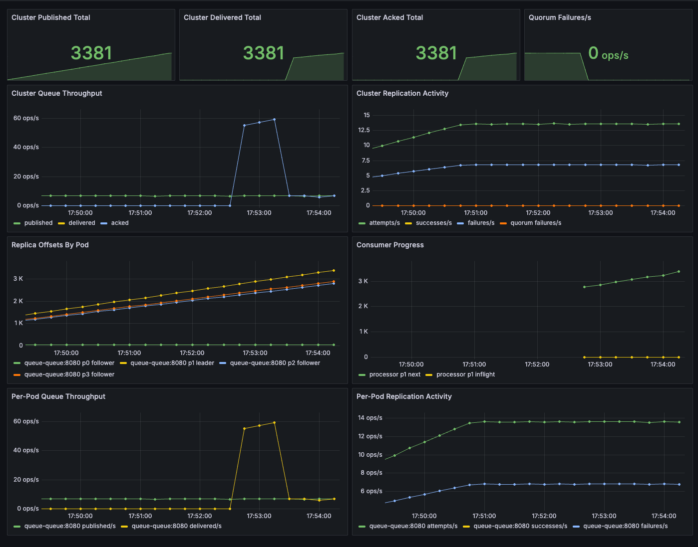

# GPU Telemetry


Distributed GPU telemetry pipeline with a replicated queue, streaming CSV replay, processor-based persistence, query API, and built-in monitoring.

More design detail, including queue internals, is in [docs/design.md](./docs/design.md).
AI workflow notes for the assignment are in [docs/ai-assistance.md](./docs/ai-assistance.md).
In this repo, `processor` is the assignment's `Telemetry Collector` component.

## Architecture



## Prerequisites

- Kubernetes cluster available locally. Minikube works.
- `kubectl` and `helm` installed and pointed at that cluster.
- The repo includes `data/dcgm_metrics_20250718_134233.csv`.
- Cluster can pull the published images, or you have pushed your own images first.

If you want to publish your own images instead of using the chart defaults:

```bash
make push-images IMAGE_REPO_PREFIX=myrepo/gpu-telemetry IMAGE_TAG=v1
```

## Bring Up Everything

Run the full stack with one command:

```bash
./bringup.sh
```

If you pushed images under a different repository or tag:

```bash
IMAGE_REPO_PREFIX=myrepo/gpu-telemetry IMAGE_TAG=v1 \
./bringup.sh
```

`bringup.sh` uses the checked-in CSV by default. `CSV_PATH` is still available if you want to point at a different file.

The script installs:

- Postgres
- 3-node queue cluster
- 3 streamer replicas with deterministic CSV sharding
- Processor (`Telemetry Collector`)
- API
- Prometheus
- Grafana

## Open These

After the script finishes, start these port-forwards in separate terminals:

```bash
kubectl port-forward svc/api-api 8080:8080
kubectl port-forward svc/grafana 3000:3000
kubectl port-forward svc/prometheus 9090:9090
```

Then open:

- API Swagger: [http://127.0.0.1:8080/swagger](http://127.0.0.1:8080/swagger)
- API OpenAPI: [http://127.0.0.1:8080/openapi.json](http://127.0.0.1:8080/openapi.json)
- GPU list: [http://127.0.0.1:8080/api/v1/gpus](http://127.0.0.1:8080/api/v1/gpus)
- Grafana: [http://127.0.0.1:3000](http://127.0.0.1:3000) (`admin:admin`)
- Prometheus: [http://127.0.0.1:9090](http://127.0.0.1:9090)

Grafana defaults to `admin:admin` and is preloaded with the `Queue Overview` dashboard.

## API Endpoints

The main evaluator-facing endpoints are:

- `GET /api/v1/gpus`
- `GET /api/v1/gpus/{id}/telemetry?start_time=...&end_time=...`
- `GET /api/v1/gpus/{id}/telemetry?window=5m`
- `GET /health`
- `GET /swagger`

## Monitoring

The queue exposes Prometheus metrics for publish, delivery, ack, inflight state, partition offsets, consumer offsets, and replication activity.

Before the processor starts consuming, the dashboard shows backlog growth without delivery or ack activity:



Once the processor is running, the dashboard shows delivery and acknowledgement activity as the backlog drains:



## Known Limitations

- The queue supports partition leadership, follower replication, and leader forwarding, but it is not a full consensus system.
- The submission focuses on unit tests and deployment verification; a dedicated end-to-end system test suite is not included.

## Development

Useful local commands:

```bash
make fmt
make test
make swagger
make build-images
make push-images
```

`make swagger` regenerates the checked-in Swagger spec in [internal/api/docs](./internal/api/docs).
The API still serves that generated spec at [http://127.0.0.1:8080/openapi.json](http://127.0.0.1:8080/openapi.json).
