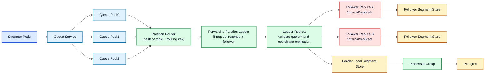

# Design Notes

This document captures the main design decisions behind the GPU telemetry pipeline, with emphasis on the custom queue.

## End-to-End Flow

- Streamers replay the checked-in CSV in a loop and replace the original CSV timestamp with the processing time.
- The queue accepts telemetry messages, routes them by `routing_key`, and durably stores them in partition logs.
- Processors act as the assignment's telemetry collectors. They consume from the queue, parse telemetry, and persist samples in Postgres.
- The API serves filtered telemetry queries from Postgres instead of reading directly from the queue.

## Queue Architecture

## Queue Design Decisions

- The queue is a standalone service, not just an in-process library. This makes scaling and Kubernetes deployment more explicit.
- Requests may land on any queue pod. If that pod is not the leader for the target partition, the publish handler forwards the request to the elected leader.
- Partitions are assigned round-robin across queue nodes. For each partition, the first replica is the leader and the remaining replicas are followers.
- Leader replicas enforce `required_follower_acks` before accepting a publish. If quorum is not reached, publish returns `503` and the streamer retries with backoff.
- Consumers read from leader-owned partitions only. Multiple processor replicas in the same consumer group share progress using per-group offsets and acknowledgements.

## Why Postgres For Persistence

- The queue is responsible for ingestion durability and decoupling, not for serving analytical queries.
- Postgres provides a simple and familiar query layer for time-window filtering, GPU listing, and Swagger-backed API validation.
- Telemetry metadata and samples are stored separately so repeated series labels are not duplicated in every query row.

## Scaling Model

- More streamer replicas increase replay throughput. Each replica uses deterministic sharding so the CSV can be processed faster without every pod replaying every row.
- More processor replicas increase consume and persist throughput while staying in the same consumer group.
- More queue replicas improve partition distribution and follower replication capacity. A replication factor of 3 with `required_follower_acks: 1` keeps writes available after a single follower failure.
